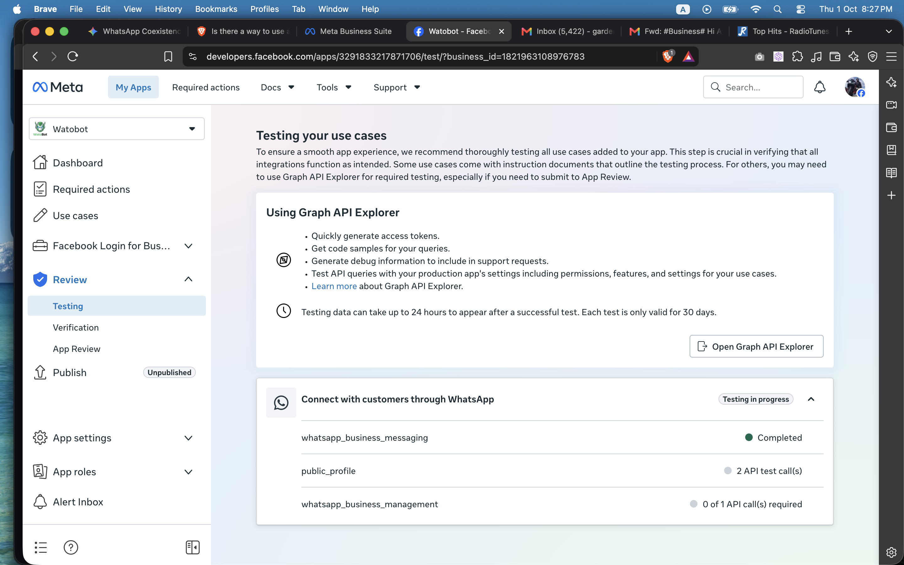

# WhatsApp Coexistence

Lets a business run the WhatsApp Business app and the WhatsApp API on the same
number at once ("coexistence"). The frontend (`public/`, generated from
`views/`) is static and deployed to GitHub Pages. The backend (`functions/`) is
Firebase Functions, Firestore and Firebase Auth.

## Setup

### 1. Business Portfolio

Create one by following steps 1 to 3 of the guide:
[How to Create a Meta Business Portfolio & Add Your WhatsApp Number](https://watobot.com/how-to/business-portfolio.html).

Stop after step 3. Skip steps 4 and 5 (adding a WhatsApp account and an app):
that guide is written for people who are their own provider. Here, the portfolio
only needs to exist so the Meta app can be attached to it in step 2. Do not add
your phone number to this portfolio. Customers' numbers, including your test
number, are connected through Embedded Signup, which creates their WABA under
their own portfolio. Pre-attaching the number to a WABA, or registering it on
the Cloud API, would make Meta treat it as an existing API number and push you
into migration instead of coexistence.

### 2. Meta app

Create the app by following
[How to Get WhatsApp API for Free](https://watobot.com/how-to/meta-app.html)
(the app-creation steps; you don't need its access token section).

Then collect three values:

- **App ID** and **App Secret**: in the app, go to **App settings → Basic**.
  Put the App ID in `public/assets/app-config.js` as `META_APP_ID` and the
  App Secret in `functions/.env` (step 3).
- **Embedded Signup Configuration ID**, created as follows. Configurations live
  under **Facebook Login for Business → Configurations**.

  1. Click **Create configuration**.

     

  2. **Name**: anything. **Login variation**: **WhatsApp Embedded Signup**.
  3. **Products**: check only **WhatsApp Cloud API**.

     

  4. **Access token**: **User access token**, with expiration **Never**. The
     business keeps this token and uses it to send messages (we never store it),
     so a 60-day expiry would break their integration every two months.

     

  5. **Assets**: **WhatsApp accounts**, with the task permission **MANAGE**.

     

  6. **Permissions**: `whatsapp_business_management` and
     `whatsapp_business_messaging`.

     

  7. Save, and put the **Configuration ID** in `public/assets/app-config.js` as
     `META_CONFIG_ID`.

### Verification

Meta requires two verifications before the app can act as a Tech Provider, both
under **Review → Verification** in the app dashboard:

- **Business verification** of the portfolio the app is attached to. Complete
  it with the same name, address and phone number you entered when creating the
  portfolio, matched to the document you upload. See Meta's
  [Verify Your Business](https://www.facebook.com/business/help/2058515294227817)
  guide.
- **Access verification**, which confirms your business is a Tech Provider. See
  Meta's [Become a Tech Provider](https://developers.facebook.com/documentation/business-messaging/whatsapp/solution-providers/get-started-for-tech-providers)
  guide. Review typically takes around 5 business days. While it is pending,
  Embedded Signup fails with "App not active".


Also under **Review → Testing**, make at least one API call that uses each
permission your use case lists (for example in Graph API Explorer), as
preparation for App Review. Meta says the results can take up to 24 hours to
appear. This is separate from the two verifications above and does not block
local testing.



Running Embedded Signup for real customers also needs the app to be an
approved Meta Tech Provider. Until then, only people with a role on the app
can use it.

### 3. Local setup

Prerequisites: Node 24 and the Firebase CLI (`npm i -g firebase-tools`).

```bash
npm install
cd functions && npm install && cp .env.example .env
```

Fill in `functions/.env`:

```
META_APP_ID=<your App ID>
META_APP_SECRET=<your App Secret>
WEBHOOK_VERIFY_TOKEN=<any string you make up>
WATOBOT_API_KEY=<your watobot API key>
```

`WATOBOT_API_KEY` is used to send the login OTP over WhatsApp through
[watobot](https://github.com/pocha/mudbot). `.env` is gitignored, so don't
commit it.

Run the tests, from `functions/`:

```bash
npm test                  # unit tests, then emulator-backed integration tests
npm run test:unit         # fast, no emulator
npm run test:integration  # real Firestore/Auth/Functions emulators
```

Run the app, from the repo root:

```bash
npm start
```

This builds the pages, serves them at `http://localhost:8765/dashboard/`, and
starts the Functions, Firestore and Auth emulators. Use `localhost`, not
`127.0.0.1`, because Meta's domain checks treat them as different domains.
`Ctrl+C` stops everything. Emulator UI: `http://127.0.0.1:4000`.

Things to know:

- Firestore and Auth are emulated, so local sign-ins are emulator-only users.
- `sendOtp` sends a real WhatsApp message through watobot, even locally.
- Embedded Signup talks to Facebook's real servers, so real values in
  `functions/.env` and `app-config.js` are needed to try it.
- In your Meta app, add `localhost` to **App Domains** and to **Allowed
  Domains for the JavaScript SDK**.

Check the app locally by signing in at `http://localhost:8765/dashboard/` with
a number you own, entering the WhatsApp OTP you receive.

### 4. Production deployment

**Frontend (GitHub Pages).** In the repo, go to **Settings → Pages → Source:
GitHub Actions**. Every push to `main` that touches `public/`, `views/` or
`scripts/build-pages.js` runs `.github/workflows/deploy-pages.yml`, which builds
the pages and publishes `public/`. The generated HTML is not committed. Set a
custom domain in the same Pages settings if you want one. The site's links
assume it is served from the root of its domain.

**Backend (Firebase).**

1. Create a Firebase project and upgrade it to the Blaze plan (Functions need
   it to make outbound calls). Enable **Firestore**. Custom-token sign-in needs
   no provider toggle.
2. Point the repo at your project: set the project id in `.firebaserc`, and the
   web config and Functions URL in `public/assets/firebase-init.js`.
3. Make sure `functions/.env` is filled in. `firebase deploy` packages the file
   as it sits on disk.
4. Deploy:

   ```bash
   firebase login
   firebase deploy --only firestore          # rules and indexes
   cd functions && npm run deploy            # builds, then deploys the Functions
   ```

### 5. Test onboarding a WABA locally

You need the pieces from steps 1 to 3 and a spare phone number registered on
the WhatsApp Business app. For the endpoint you give the wizard, use the
included `test-chatbot/`: a small Node app (no dependencies) that answers
Meta's verification handshake, logs every incoming event, and replies "You
said: ..." through the relay.

1. In the Meta app, confirm Access Verification is cleared. While it is
   pending, Embedded Signup fails with "App not active".
2. Start the test chatbot (Node 24):

   ```bash
   cd test-chatbot
   cp .env.example .env     # set WEBHOOK_VERIFY_TOKEN to the same value as functions/.env
   npm start
   ```

3. In a second terminal, expose it over public HTTPS. Meta calls your endpoint
   directly, and the wizard rejects non-HTTPS URLs:

   ```bash
   brew install cloudflared            # once
   cloudflared tunnel --url http://localhost:3000
   ```

   (`ngrok http 3000` works too.) Your endpoint URL is the printed
   `https://....trycloudflare.com` address plus `/webhook`, for example
   `https://random-words.trycloudflare.com/webhook`.
4. In a third terminal, from the repo root, `npm start` and open
   `http://localhost:8765/dashboard/`.
5. Sign in with a number you own and the OTP sent to it.
6. Click **Onboard a WABA** and complete Meta's popup with the spare number. You
   must have a role on the Meta app. For a number on the Business app, Meta
   sends a verification code to the Business app, with a **Connect** button.
7. Step 2 of the wizard: paste your endpoint URL and click **Test endpoint &
   activate**. The test chatbot's terminal prints `GET /webhook handshake: ok`.
8. Step 3: copy the access token. It is shown once and not stored. Put it in
   `test-chatbot/.env` as `ACCESS_TOKEN` and restart the test chatbot, so it can
   reply.
9. From another phone, send a WhatsApp message to the number. The test chatbot
   logs it and replies "You said: ...", and you should receive that reply.
10. To send through the relay yourself (free-form text only works within 24 hours
    of the customer's last message, so do step 9 first):

    ```bash
    curl -X POST \
      "http://127.0.0.1:5001/wa-coexistence/us-central1/relayMessage/<phoneNumberId>/messages" \
      -H "Authorization: Bearer <your access token>" \
      -H "Content-Type: application/json" \
      -d '{"messaging_product":"whatsapp","to":"<recipient>","type":"text","text":{"body":"Hello!"}}'
    ```

Known gap that may show up here: Meta's coexistence docs also require the
`smb_app_state_sync` and `smb_message_echoes` webhooks and a history sync within
24 hours. This app doesn't do those yet.
