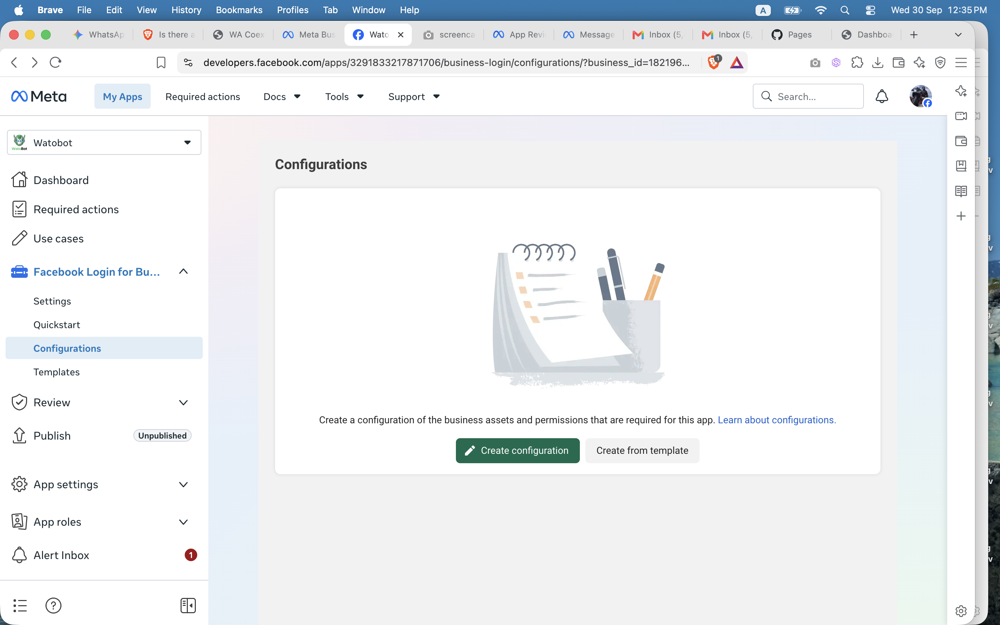
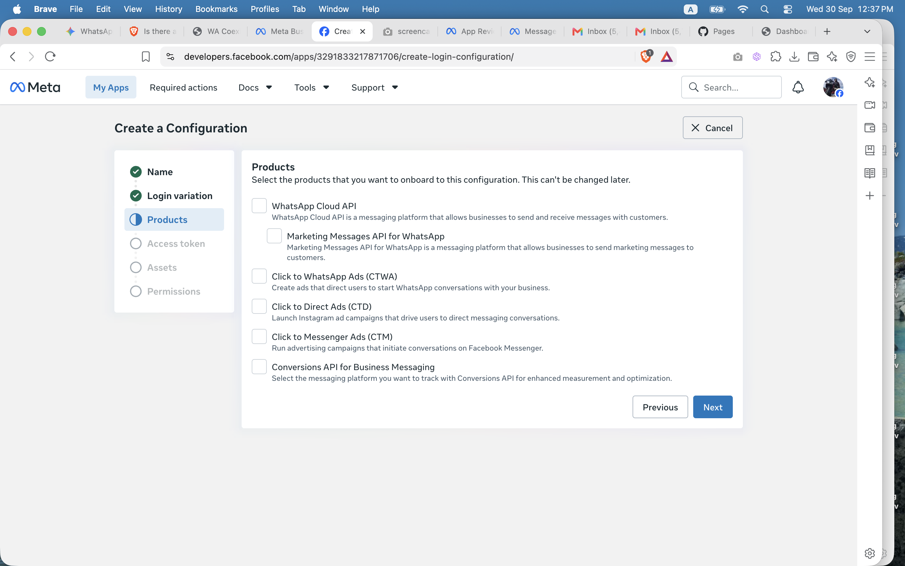
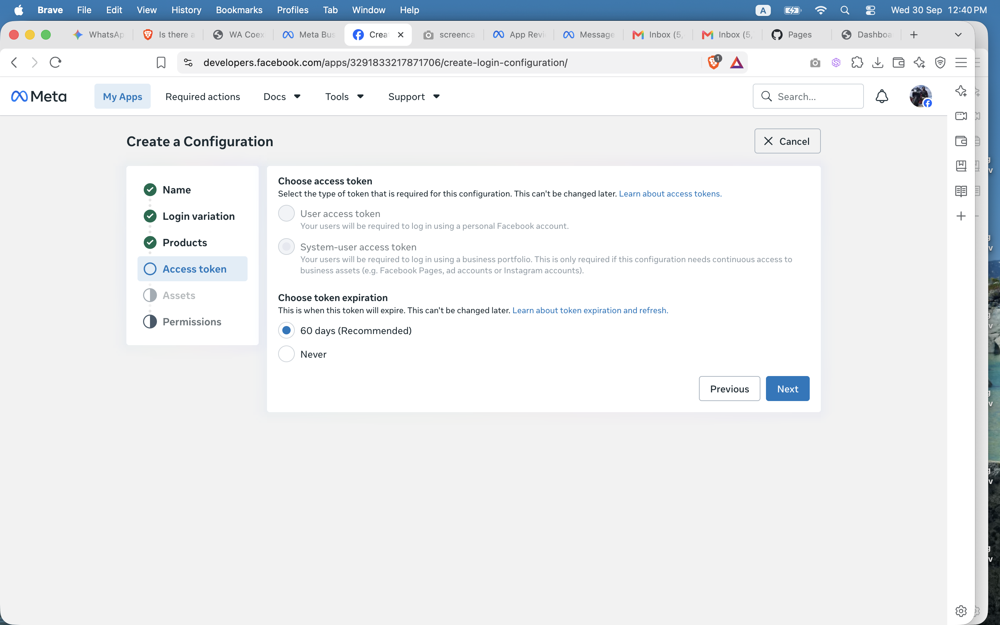
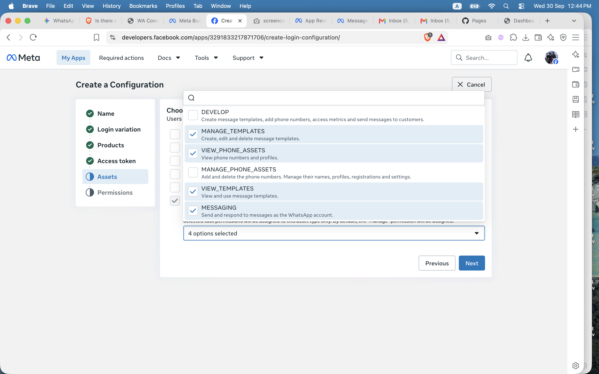
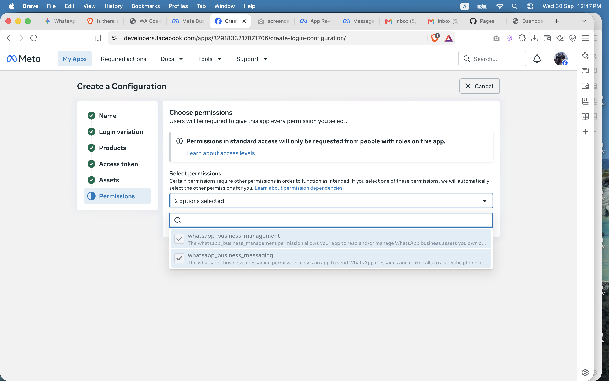
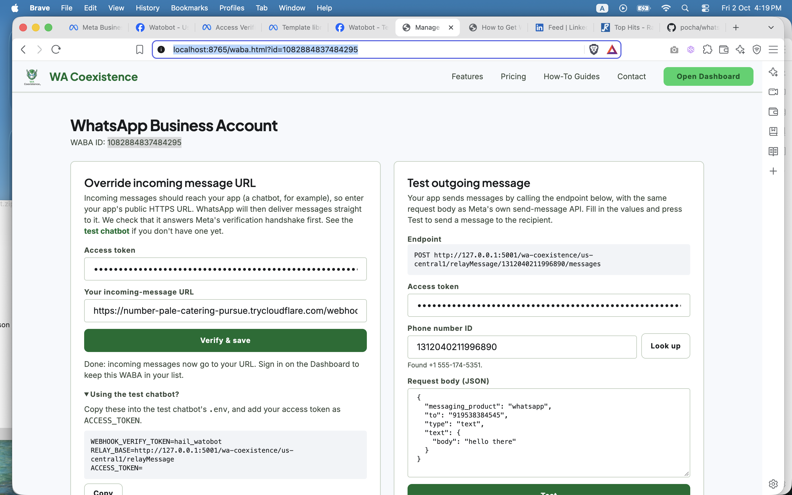
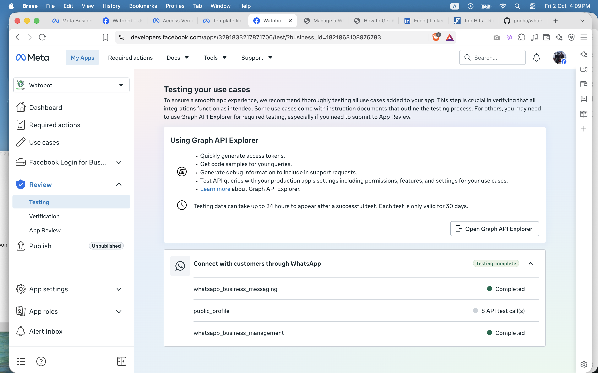
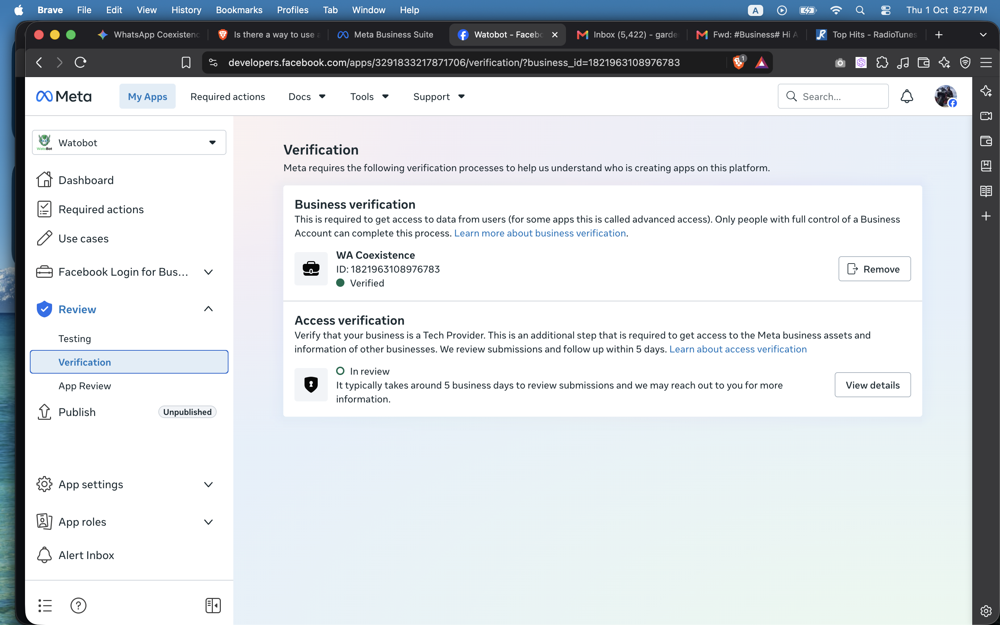

# WhatsApp Coexistence

Lets a business run the WhatsApp Business app and the WhatsApp API on the same
number at once ("coexistence"). The frontend (`public/`, generated from
`views/`) is static and deployed to GitHub Pages. The backend (`functions/`) is
Firebase Functions, Firestore and Firebase Auth.

## Setup

### 1. Business Portfolio

Create one by following steps 1 to 3 of the guide:
[How to Create a Meta Business Portfolio & Add Your WhatsApp Number](https://watobot.com/how-to/create-meta-business-portfolio-add-whatsapp-number.html).

Stop after step 3. Skip steps 4 and 5 (adding a WhatsApp account and an app):
that guide is written for people who are their own provider. Here, the portfolio
only needs to exist so the Meta app can be attached to it in step 2. Do not add
your phone number to this portfolio. Customers' numbers, including your test
number, are connected through Embedded Signup, which creates their WABA under
their own portfolio. Pre-attaching the number to a WABA, or registering it on
the Cloud API, would make Meta treat it as an existing API number and push you
into migration instead of coexistence.

### 2. Meta app

Create the app by following
[How to Get WhatsApp API for Free](https://watobot.com/how-to/get-whatsapp-api-for-free.html)
(the app-creation steps; you don't need its access token section).

Then collect three values:

- **App ID** and **App Secret**: in the app, go to **App settings → Basic**.
  Put the App ID in `public/assets/app-config.js` as `META_APP_ID` and the
  App Secret in `functions/.env` (step 3).
- **Embedded Signup Configuration ID**, created as follows. Configurations live
  under **Facebook Login for Business → Configurations**.

  1. Click **Create configuration**.

     

  2. **Name**: anything. **Login variation**: **WhatsApp Embedded Signup**.
  3. **Products**: check only **WhatsApp Cloud API**.

     

  4. **Access token**: **System-user access token**, with expiration **Never**.
     Meta says Tech Providers should use business (system-user) tokens, which
     belong to the customer's business, not to the person who ran the popup,
     and don't depend on that person staying in the business. The token can't
     be changed after the Configuration is created.

     

  5. **Assets**: **WhatsApp accounts**, with the task permission **MANAGE**.

     

  6. **Permissions**: `whatsapp_business_management` and
     `whatsapp_business_messaging`.

     

  7. Save, and put the **Configuration ID** in `public/assets/app-config.js` as
     `META_CONFIG_ID`.

### Permissions

Under **Other tools → Permissions and features**, the app only needs
`whatsapp_business_management` and `whatsapp_business_messaging`. Don't add
anything else. `business_management`, `email`, `manage_app_solution` and
`whatsapp_business_manage_events` aren't used. `public_profile` is granted
automatically.

.permissions.png)

The app's own webhook, and the verifications Meta requires, come after the
backend is deployed (step 4).

### How customer tokens are handled

Meta requires a Tech Provider to protect, and not share, customers' access tokens, so
we hold each customer's token and never hand it out.

- Each account has a **Watobot API key**: 32 random bytes, generated in the
  browser and shown once, when the account first onboards a number. We store only a
  hash of it, on the user record. The browser doesn't keep it: the user types it
  whenever it is needed. Whenever a key is created or replaced, the user is signed
  out, so they have to type it to sign in again and see how much it matters.
- The key derives (HKDF-SHA256, with separate labels) both that hash and an
  AES-256-GCM key. The second one encrypts each number's Meta token, on
  `wabas/{phoneNumberId}`. The hash can't decrypt anything, and there is no server
  secret, so the stored data is unreadable without the customer's key.
- A request that carries the key (a send through the relay, setting the
  incoming URL, managing templates) lets the backend decrypt the token in memory,
  use it, and drop it.
- **Rotating** the key needs the old one, and the browser re-encrypts every token under
  the new key in one batch. A **lost key can't be recovered**: resetting it (from the
  sign-in screen, the dashboard or the onboarding page) warns that the onboarded WABAs
  will be useless, deletes the stored tokens, and gives a new key. Each number must
  then be onboarded again.
- **Users manage their own account from the browser** (`public/assets/account.js`):
  creating, rotating and resetting the key, and deleting the account. Functions are only
  for what needs the Meta App Secret or the stored token: onboarding, the relay, setting
  the incoming URL, templates, and the sign-in reset.

Data model. Functions create these records; a signed-in user can then read and manage
only their own, within the limits in `firestore.rules` (they can never change `userId`,
`usage` or `lastRelayCall`):

| Document | Fields |
|---|---|
| `users/{randomUserId}` | `phoneNumber`, `apiKeyHash`, `createdAt`, `rotatedAt` |
| `phoneIndex/{phone}` | `userId` |
| `wabas/{phoneNumberId}` | `userId`, `wabaId`, `phoneNumberId`, `encAccessToken`, `overrideUrl`, `activatedAt`, `lastRelayCall`, `usage` |

The Firebase sign-in `uid` is the random user ID, not the phone number.

### 3. Local setup

Prerequisites: Node 24 and the Firebase CLI (`npm i -g firebase-tools`).

```bash
npm install
cd functions && npm install && cp .env.example .env
```

Fill in `functions/.env`:

```
META_APP_ID=<your App ID>
META_APP_SECRET=<your App Secret>
WEBHOOK_VERIFY_TOKEN=<any string you make up>
WATOBOT_API_KEY=<your watobot API key>
```

`WATOBOT_API_KEY` is used to send the login OTP over WhatsApp through
[watobot](https://github.com/pocha/mudbot). `.env` is gitignored, so don't
commit it. `WEBHOOK_VERIFY_TOKEN` must also equal the `WEBHOOK_VERIFY_TOKEN` in
`public/assets/app-config.js`, which the WABA page shows to people setting up the
test chatbot.

Run the tests, from `functions/`:

```bash
npm test                  # unit tests, then emulator-backed integration tests
npm run test:unit         # fast, no emulator
npm run test:integration  # real Firestore/Auth/Functions emulators
```

Run the app, from the repo root:

```bash
npm start
```

This builds the pages, serves them at `http://localhost:8765/dashboard/`, and
starts the Functions, Firestore and Auth emulators. Use `localhost`, not
`127.0.0.1`, because Meta's domain checks treat them as different domains.
`Ctrl+C` stops everything. Emulator UI: `http://127.0.0.1:4000`.

Things to know:

- Firestore and Auth are emulated, so local sign-ins are emulator-only users.
- `sendOtp` sends a real WhatsApp message through watobot, even locally.
- Embedded Signup talks to Facebook's real servers, so real values in
  `functions/.env` and `app-config.js` are needed to try it.
- In your Meta app, add `localhost` to **App Domains** and to **Allowed
  Domains for the JavaScript SDK**.

Check the app locally by signing in at `http://localhost:8765/dashboard/` with
a number you own, entering the WhatsApp OTP you receive.

**Waitlist mode.** While the app waits for Meta's approval, `/dashboard/` and
`/dashboard/waba.html` redirect visitors to the landing page (`/?join-waitlist=true`),
which shows a notice. The landing page's **Join Waitlist** button reveals the
Google Group link, and a count of people who clicked it is kept in
`meta/waitlist`, incremented by the `joinWaitlist` function once per browser.
The dashboard still opens on `localhost`, and on any other host after visiting
`/dashboard/?preview=1` once (remembered in that browser). To launch, delete the
redirect script near the top of `views/pages/dashboard.html` and
`views/pages/dashboard-waba.html`, and point the nav button back at `/dashboard/`.

### 4. Production deployment

**Frontend (GitHub Pages).** In the repo, go to **Settings → Pages → Source:
GitHub Actions**. Every push to `main` that touches `public/`, `views/` or
`scripts/build-pages.js` runs `.github/workflows/deploy-pages.yml`, which builds
the pages and publishes `public/`. The generated HTML is not committed. Set a
custom domain in the same Pages settings if you want one. The site's links
assume it is served from the root of its domain.

**Backend (Firebase).**

1. Create a Firebase project and upgrade it to the Blaze plan (Functions need
   it to make outbound calls). Enable **Firestore**. Custom-token sign-in needs
   no provider toggle.
2. Point the repo at your project: set the project id in `.firebaserc`, and the
   web config and Functions URL in `public/assets/firebase-init.js`.
3. Make sure `functions/.env` is filled in. `firebase deploy` packages the file
   as it sits on disk.
4. Deploy:

   ```bash
   firebase login
   firebase deploy --only firestore          # rules and indexes
   cd functions && npm run deploy            # builds, then deploys the Functions
   ```

**Let `verifyOtp` sign login tokens (once per project).** Login mints a Firebase
custom token, which the function must sign. In production it signs as its own
service account, and that account needs permission to do so. Without it, sign-in
fails with `Permission 'iam.serviceAccounts.signBlob' denied`. Find the account
the function runs as, then grant it the **Service Account Token Creator** role on
itself:

```bash
SA=$(gcloud run services describe verifyotp --region us-central1 \
  --project <project-id> --format="value(spec.template.spec.serviceAccountName)")

gcloud iam service-accounts add-iam-policy-binding "$SA" \
  --member="serviceAccount:$SA" \
  --role="roles/iam.serviceAccountTokenCreator" \
  --project <project-id>
```

This is the project's default compute service account
(`<project-number>-compute@developer.gserviceaccount.com`), and the role is
granted on that account only, not on the whole project. The IAM Service Account
Credentials API (`iamcredentials.googleapis.com`) must be enabled, which it
normally is. The change can take a minute or two to apply. It isn't needed
locally, where the Auth emulator doesn't check signatures.

**The app's webhook (after the deploy).** When `firebase deploy` finishes it
prints the URL of each function, including a line like
`Function URL (webhook(us-central1)): https://...`. That is your webhook URL.
Meta requires the app itself to have a webhook before a business's
incoming-URL override can be set. Without one, **Verify & save** on a WABA's
page fails with "your app must be subscribed to receive messages for WhatsApp
Business Account".

1. In the app dashboard, go to **Use cases → Customize → Step 2. Production
   setup → Configure Webhooks** and set:
   - **Callback URL**: the `webhook` function URL from the deploy output.
   - **Verify token**: the same value as `WEBHOOK_VERIFY_TOKEN` in
     `functions/.env` (and in `public/assets/app-config.js`).

   Click **Verify and save**. Meta calls the function to check the token, so
   it must already be deployed.

   .dashboard-webhook-setup.png)

2. Under **Webhook fields**, subscribe to exactly these, and switch the rest
   off:

   | Field | Why |
   |---|---|
   | `messages` | Incoming messages and delivery statuses. |
   | `smb_message_echoes` | Messages typed in the Business app, so a bot doesn't reply on top of a human. |
   | `smb_app_state_sync` | Contact and state sync for coexistence. |
   | `history` | Chat history sync for coexistence. |
   | `message_template_status_update` | Tells a business when a template is approved or rejected. |

   .dashboard-webhook-fields.png)

   (That screenshot shows Meta's default selection, which is longer than the
   list above.)

### Testing and verification

Meta requires the following before the app can act as a Tech Provider.

**Review → Testing.** Meta wants an API call made with each permission your use
case lists. Do both from the page of the test number that came with your app. It
needs an incoming-message URL; if you don't have an app, use the
[test chatbot](test-chatbot/README.md) for one.

Embedded Signup isn't available yet, so store the test number's token yourself
with the seed script, the same way onboarding would:

1. In **Use cases → Customize → Production setup → Send message**, click
   **Generate token** and copy it. Find the test number's phone number ID there,
   and its WABA ID in Business Settings → Accounts → WhatsApp accounts.
2. Run the script from the repo root. It creates your account (if needed), makes a
   Watobot API key and prints it once, and stores the token encrypted under that
   key:

   ```bash
   META_ACCESS_TOKEN=<the token> node scripts/seed-test-waba.js \
     --phone <your WhatsApp number, digits only> \
     --phone-number-id <test phone number ID> --waba-id <test WABA ID>
   ```

   (Run `cd functions && npm run build` once first. It writes to production using
   your gcloud credentials, or to the emulator if `FIRESTORE_EMULATOR_HOST` is set.
   To add another number to an account that already has a key, pass
   `--api-key <that key>`.)
3. Run the app (step 3), sign in, and open
   `http://localhost:8765/waba.html?id=<test phone number ID>`.
4. **Override incoming message URL**: enter your Watobot API key and your app's
   public HTTPS URL, then click **Verify & save**. This completes the test for
   `whatsapp_business_management`.
5. **Test outgoing message**: enter the key, fill in `to` and the message text, and
   click **Test**. This completes the test for `whatsapp_business_messaging`.



Meta says the results can take up to 24 hours to appear, and each test stays
valid for 30 days. `public_profile` needs no specific count. When everything is
done, the page looks like this:



**Review → Verification.** Meta requires two verifications:

- **Business verification** of the portfolio the app is attached to. Complete
  it with the same name, address and phone number you entered when creating the
  portfolio, matched to the document you upload. See Meta's
  [Verify Your Business](https://www.facebook.com/business/help/2058515294227817)
  guide.
- **Access verification**, which confirms your business is a Tech Provider. See
  Meta's [Become a Tech Provider](https://developers.facebook.com/documentation/business-messaging/whatsapp/solution-providers/get-started-for-tech-providers)
  guide. Review typically takes around 5 business days. While it is pending,
  Embedded Signup fails with "App not active".



Embedded Signup does not work until the app has Advanced Access to
`whatsapp_business_management` and `whatsapp_business_messaging`, which comes
from App Review. Being an admin of the app does not get around it: the popup
fails with "Partner app lacks required advanced WhatsApp Business management
and messaging permissions for onboarding" (error `#2655111`). Until then you can
test everything except onboarding: the incoming-URL override and sending work
on any WABA you hold a token for, such as the test account that came with your
app (see "Review → Testing" above).
